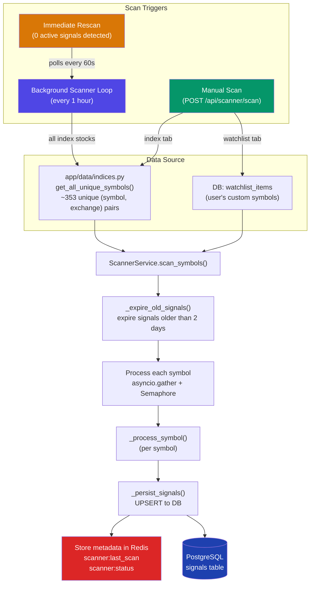
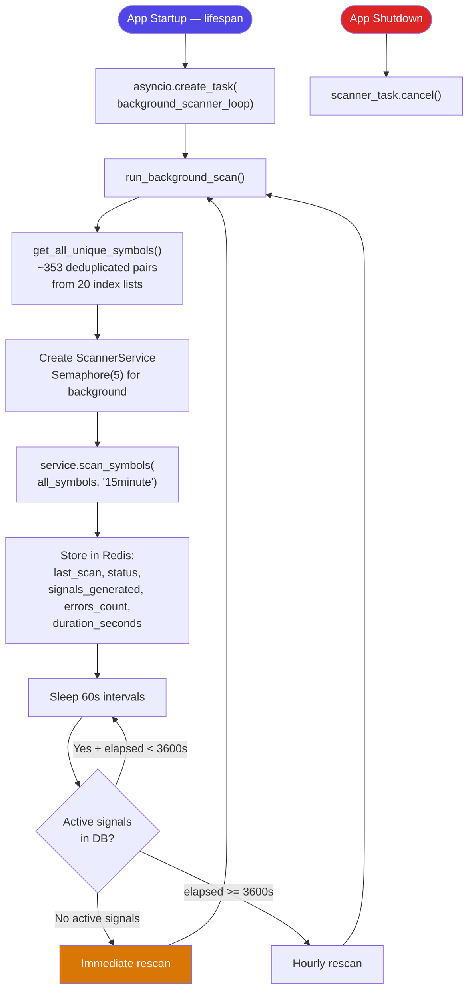
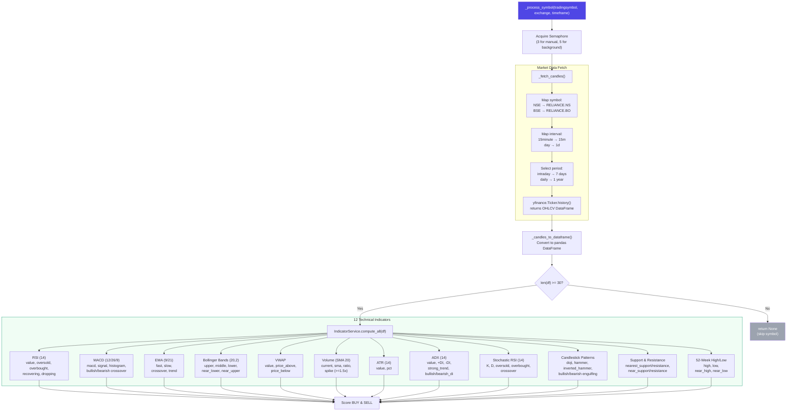
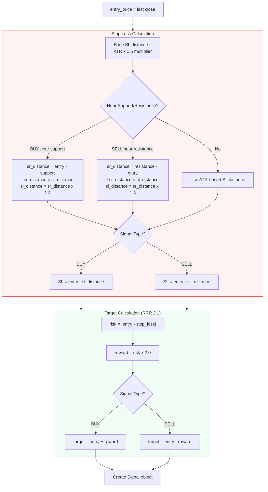
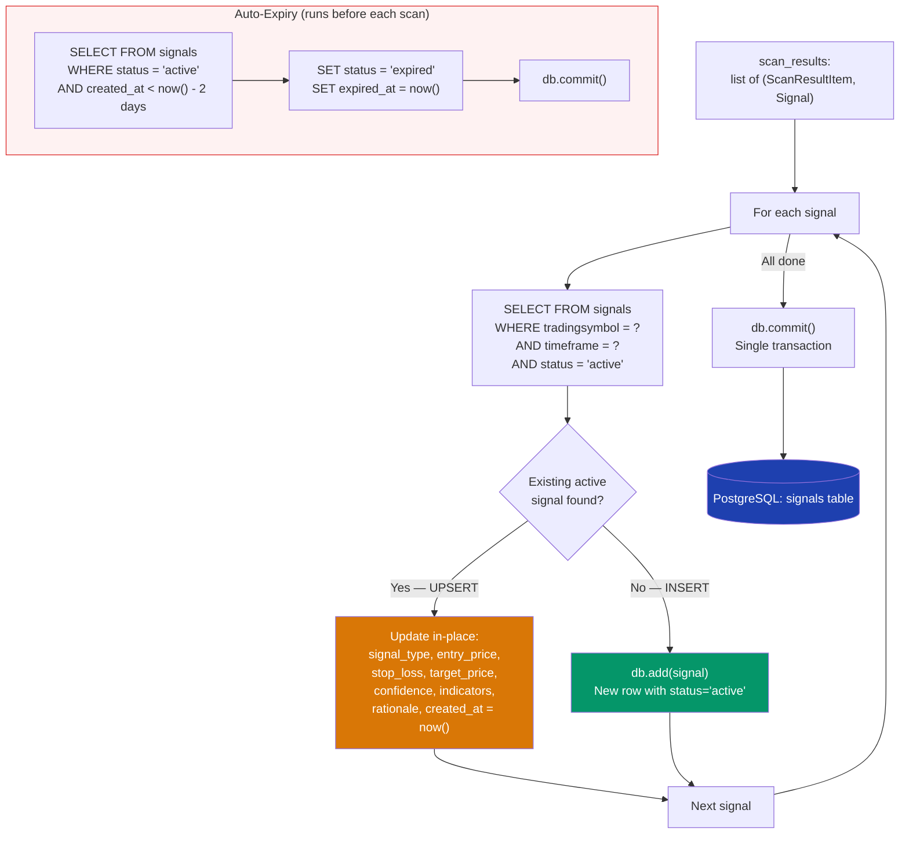
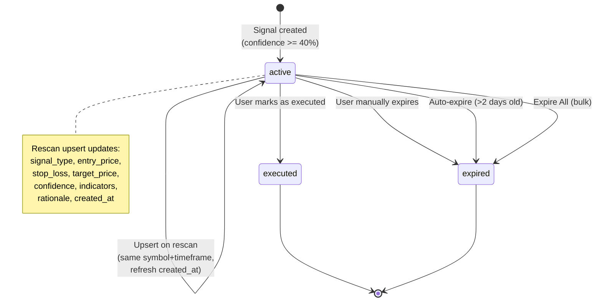
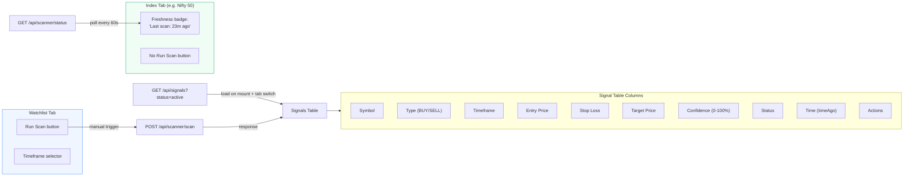

# Scanner — End-to-End Signal Generation Flow

## 1. High-Level Architecture



## 2. Background Scanner Loop



## 3. Per-Symbol Processing Pipeline



## 4. Signal Scoring — BUY vs SELL

```mermaid
flowchart TD
    INDICATORS["All 12 Indicators Computed"] --> BUY_SCORE["_score_buy()"]
    INDICATORS --> SELL_SCORE["_score_sell()"]

    subgraph BuyScoring["BUY Score (max 200 pts)"]
        direction TB
        B1["RSI oversold (<30) → +20"]
        B2["RSI recovering from oversold → +10"]
        B3["MACD bullish crossover → +20"]
        B4["MACD histogram positive → +10"]
        B5["EMA 9/21 bullish crossover → +15<br/>OR EMA bullish trend → +5"]
        B6["Price above VWAP → +10"]
        B7["Near lower Bollinger Band → +15"]
        B8["Volume spike (>=1.5x) → +10"]
        B9["Near support level → +15"]
        B10["Near resistance + volume spike<br/>(breakout) → +20"]
        B11["Near 52-week low → +5"]
        B12["Strong ADX + bullish DI → +15"]
        B13["Stoch RSI oversold (<20) → +10"]
        B14["Stoch RSI bullish crossover → +10"]
        B15["Hammer pattern → +10"]
        B16["Bullish engulfing → +15"]
    end

    subgraph SellScoring["SELL Score (max 200 pts)"]
        direction TB
        S1["RSI overbought (>70) → +20"]
        S2["RSI dropping from overbought → +10"]
        S3["MACD bearish crossover → +20"]
        S4["MACD histogram negative → +10"]
        S5["EMA 9/21 bearish crossover → +15<br/>OR EMA bearish trend → +5"]
        S6["Price below VWAP → +10"]
        S7["Near upper Bollinger Band → +15"]
        S8["Volume spike (>=1.5x) → +10"]
        S9["Near resistance level → +15"]
        S10["Near support + volume spike<br/>(breakdown) → +20"]
        S11["Near 52-week high → +5"]
        S12["Strong ADX + bearish DI → +15"]
        S13["Stoch RSI overbought (>80) → +10"]
        S14["Stoch RSI bearish crossover → +10"]
        S15["Inverted hammer → +10"]
        S16["Bearish engulfing → +15"]
    end

    BUY_SCORE --> BuyScoring
    SELL_SCORE --> SellScoring

    BuyScoring --> COMPARE{"BUY score >= SELL score<br/>AND score > 0?"}
    SellScoring --> COMPARE

    COMPARE -->|"BUY wins"| TYPE_BUY["signal_type = BUY<br/>raw_score = buy_score"]
    COMPARE -->|"SELL wins"| TYPE_SELL["signal_type = SELL<br/>raw_score = sell_score"]
    COMPARE -->|"Both 0"| SKIP["return None — no signal"]

    TYPE_BUY --> CONFIDENCE
    TYPE_SELL --> CONFIDENCE

    CONFIDENCE["confidence = (raw_score / 200) * 100<br/>capped at 100%"]
    CONFIDENCE --> THRESHOLD{"confidence >= 40%?"}
    THRESHOLD -->|"No"| SKIP2["return None — too weak"]
    THRESHOLD -->|"Yes"| SL_TARGET["Compute SL & Target"]

    style BuyScoring fill:#f0fdf4,stroke:#059669
    style SellScoring fill:#fef2f2,stroke:#dc2626
    style SKIP fill:#9ca3af,color:#fff
    style SKIP2 fill:#9ca3af,color:#fff
```



## 5. Stop Loss & Target Computation



## 6. Signal Persistence — Upsert & Dedup



## 7. Signal Lifecycle



## 8. Frontend Data Flow



## 9. Complete End-to-End Sequence

```mermaid
sequenceDiagram
    participant Loop as Background Loop
    participant Indices as indices.py
    participant Scanner as ScannerService
    participant Expiry as _expire_old_signals
    participant YF as yfinance
    participant Indicator as IndicatorService
    participant Scoring as _score_buy/_sell
    participant SL as _compute_stop_loss
    participant DB as PostgreSQL
    participant Redis as Redis

    Loop->>Indices: get_all_unique_symbols()
    Indices-->>Loop: ~353 (symbol, exchange) pairs

    Loop->>Scanner: scan_symbols(all_symbols, "15minute")

    Scanner->>Expiry: expire signals > 2 days old
    Expiry->>DB: UPDATE status='expired' WHERE created_at < cutoff
    Expiry-->>Scanner: done

    par For each symbol (Semaphore=5)
        Scanner->>YF: fetch OHLCV (7d, 15m interval)
        YF-->>Scanner: candles[]
        Scanner->>Scanner: _candles_to_dataframe()
        Scanner->>Indicator: compute_all(df)

        Note over Indicator: RSI, MACD, EMA, Bollinger,<br/>VWAP, Volume, ATR, ADX,<br/>Stoch RSI, Candlestick,<br/>Support/Resistance, 52-Week

        Indicator-->>Scanner: indicators dict

        Scanner->>Scoring: _score_buy(indicators)
        Scoring-->>Scanner: buy_score (0-200)
        Scanner->>Scoring: _score_sell(indicators)
        Scoring-->>Scanner: sell_score (0-200)

        Note over Scanner: Pick stronger signal<br/>confidence = (score/200)*100<br/>Skip if < 40%

        Scanner->>SL: _compute_stop_loss(entry, ATR, S/R)
        SL-->>Scanner: stop_loss
        Scanner->>Scanner: _compute_target(RRR 2:1)
        Scanner->>Scanner: _generate_rationale()
    end

    Scanner->>DB: UPSERT for each signal<br/>(match on symbol+timeframe+active)
    DB-->>Scanner: committed

    Scanner-->>Loop: (results, errors)

    Loop->>Redis: SET scanner:last_scan
    Loop->>Redis: HSET scanner:status

    loop Every 60s
        Loop->>DB: COUNT active signals
        alt 0 active signals
            Loop->>Loop: Break — immediate rescan
        else elapsed >= 3600s
            Loop->>Loop: Break — hourly rescan
        end
    end
```
